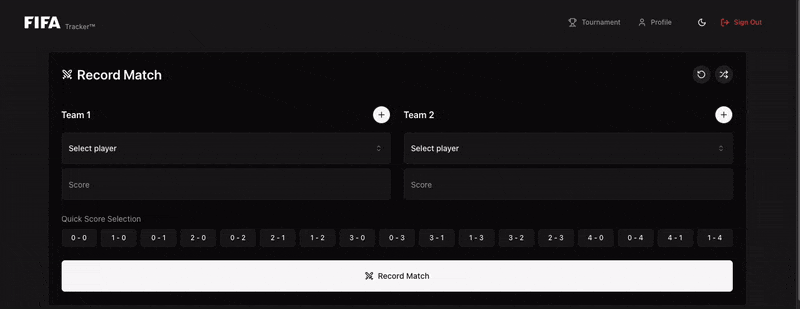

<p align="center">
    
</p>

# FIFA Match Tracker

FIFA Match Tracker is a comprehensive web application that helps players track their FIFA matches, organize tournaments, and monitor achievements. Built with React, TypeScript, and Supabase.


## Table of Contents
1. [Features](#features)
2. [Technical Stack](#technical-stack)
3. [Development](#development)
4. [Building for Production](#building-for-production)
5. [Database Schema](#database-schema)
6. [Contributing](#contributing)
7. [License](#license)

## Features

- 🏟 **Match Tracking**: Track FIFA matches, scores, and player stats.
- 🏆 **Tournament Management**: Create tournaments for 4–32 players with automated brackets.
- 📊 **Player Statistics**: Analyze rankings, win/loss ratios, and performance trends.
- 🎖 **Achievements**: Unlock over 20 unique achievements with rarity tiers.
- 🏅 **Profile Dashboard**: Showcase achievements, view match history, and monitor analytics.

## Technical Stack
- 🖼️ **Frontend**: [React](https://reactjs.org/) + TypeScript
- 🎨 **Styling**: [Tailwind CSS](https://tailwindcss.com/) + [shadcn/ui](https://ui.shadcn.dev/)
- 🚀 **Backend**: [Supabase](https://supabase.io/)
- 🔒 **Authentication**: Supabase Auth
- 📊 **Database**: PostgreSQL
- 🖌️ **Icons**: [Lucide React](https://lucide.dev/)
- 📅 **Date Handling**: [date-fns](https://date-fns.org/)
- 📋 **Forms**: [React Hook Form](https://react-hook-form.com/) + Zod

## Development

1. Clone the repository
2. Install dependencies:
   ```bash
   npm install
   ```
3. Set up environment variables:
   ```bash
   VITE_SUPABASE_URL=your_supabase_url
   VITE_SUPABASE_ANON_KEY=your_supabase_anon_key
   ```
4. Start the development server:
   ```bash
   npm run dev
   ```

## Building for Production

Build the project with:
```bash
npm run build
```

## Database Schema

The application uses the following main tables:
- `achievements`: User achievement tracking
- `match_players`: Player participation and performance in matches
- `matches`: Match records and scores
- `profiles`: User profiles and settings
- `tournament_matches`: Individual tournament match data
- `tournaments`: Tournament information

## How to Contribute

1. 🍴 Fork the repository 
2. 🌿 Create a new branch for your feature (`git checkout -b feature-name`)
3. 🚀 Commit and push changes
4. 📋 Submit a Pull Request for review

## Screengrabs
<p align="center">
  
</p>

## License


This project is licensed under the MIT License. See the LICENSE file for details.

<p>
    Made with ❤️ by the FIFA Tracker Team
</p>
